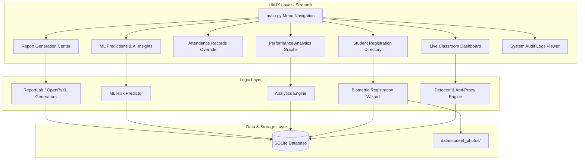

# 🛡️ SmartAttend AI
### Intelligent Classroom Attendance & Student Analytics Platform

SmartAttend AI is an enterprise-grade EdTech classroom intelligence platform designed to automate classroom attendance using computer vision, secure attendance registers against proxy attendance fraud, forecast students at risk of falling below attendance thresholds using machine learning, and provide educators with an analytics dashboard.

This is a complete, production-quality SaaS/EdTech implementation featuring a professional UI, database integrity, modular clean architecture, and advanced anti-proxy algorithms.

---

## 🚀 Key Features

1. **Smart Biometric Scan Engine**: Face detection and recognition using OpenCV and `face_recognition` models with custom distance-to-confidence mappings.
2. **Anti-Proxy Anti-Fraud System**: 
   - **Multi-Frame Verification**: 8 consecutive frame stability confirmation before marking attendance.
   - **Centroid tracking**: Face tracking using Euclidean centroid distances across frames.
   - **Photo Spoof Protection**: Standard deviation monitoring of bounding boxes to detect static 2D images (prints/phones) vs. micro-movements of live faces.
   - **Multi-Face Blocks**: Disables logging if more than one face is present in the frame.
3. **Classroom Intelligence Dashboard**: Real-time KPI metrics, active feed canvas, tracking timelines, and activity logging.
4. **Predictive Risk Center**: A Scikit-Learn **Random Forest Classifier** trained on historical student records to forecast students likely to drop below 75% attendance. Includes custom intervention recommendations.
5. **Interactive Plotly Analytics**: Daily/weekly trends, department benchmarks, day-of-week averages, and student health distribution boards.
6. **Executive PDF & Excel Reporting**: Generates reports (using ReportLab flowables with custom page numbering canvas and openpyxl spreadsheets) for:
   - *Student Report Cards* (individual history, health scores).
   - *Class Summaries* (department rosters, defaulter markers).
   - *Faculty Dashboards* (department KPIs, AI action plans).
7. **System Audit Trail**: Complete logging of administrative changes, biometric updates, manual log overrides, and system tasks in an SQLite audit table.

---

## 🏛️ System Architecture



---

## 🗄️ Database Schema Design

SQLite tables with native `ON DELETE CASCADE` constraints and indices:

### `Students`
- `student_id` (TEXT, PRIMARY KEY): Unique identifier.
- `name` (TEXT): Full student name.
- `roll_no` (TEXT): Academic roll number.
- `department` (TEXT): CS, IT, Mechanical, etc.
- `year` (TEXT): First Year, Second Year, etc.
- `division` (TEXT): Division identifier.
- `email` (TEXT): Contact email.
- `phone` (TEXT): Contact phone.
- `photo_path` (TEXT): Profile photo thumbnail.

### `Face_Encodings`
- `encoding_id` (INTEGER, PRIMARY KEY AUTOINCREMENT)
- `student_id` (TEXT, FOREIGN KEY references Students)
- `encoding_data` (BLOB): Binary blob of 128-dimensional NumPy float array.

### `Attendance`
- `attendance_id` (INTEGER, PRIMARY KEY AUTOINCREMENT)
- `student_id` (TEXT, FOREIGN KEY references Students)
- `date` (TEXT): Date in `YYYY-MM-DD` format (Unique constraint on `(student_id, date)` to prevent double marking).
- `time` (TEXT): Time in `HH:MM:SS`.
- `confidence_score` (REAL): Average recognition confidence.
- `verification_status` (TEXT): `VERIFIED`, `PROXY_SUSPECT`, or `ABSENT`.

### `Risk_Assessment`
- `student_id` (TEXT, PRIMARY KEY, FOREIGN KEY references Students)
- `health_score` (REAL): Cumulative attendance score (0-100).
- `risk_score` (REAL): Predicted probability of falling below 75% attendance.
- `category` (TEXT): `Excellent`, `Good`, `Warning`, `Critical`.

### `Audit_Logs`
- `log_id` (INTEGER, PRIMARY KEY AUTOINCREMENT)
- `timestamp` (TEXT)
- `action` (TEXT)
- `user` (TEXT): Account triggering the action.

---

## 📂 Project Structure

```
smart_attend_ai/
├── app/
│   ├── views/
│   │   ├── dashboard_view.py       # Live classroom stream & verification overlays
│   │   ├── registration_view.py    # CRUD student records & multi-pose scan
│   │   ├── records_view.py         # Attendance logs & manual overrides
│   │   ├── analytics_view.py       # Plotly line, bar, pie charts
│   │   ├── predictions_view.py     # ML predictions lists & AI insights panels
│   │   ├── reports_view.py         # PDF / Excel / CSV download templates
│   │   └── audit_view.py           # Database logs & seeder administration
│   └── ui_components.py            # Glassmorphic cards & global styles
├── analytics/
│   └── engine.py                   # KPI logic & text insights engine
├── config/
│   └── config.py                   # Settings, threshold values & directory paths
├── database/
│   └── db_manager.py               # SQLite connection pool & CRUD helper methods
├── face_engine/
│   ├── detector.py                 # OpenCV webcam parser & face_recognition wrapper
│   └── anti_proxy.py               # Centroid tracker & stability algorithms
├── logs/
│   └── app.log                     # Standard debugging files
├── ml/
│   └── predictor.py                # Random Forest predictor & historical seeder
├── models/
│   ├── student.py
│   ├── attendance.py
│   ├── risk.py
│   └── audit_log.py
├── reports/
│   └── generator.py                # Flowable ReportLab canvas & openpyxl spreadsheets
├── tests/
│   └── test_db.py                  # Database unit tests
├── requirements.txt                # Packages
└── main.py                         # Application router
```

---

## 🛠️ Installation & Setup

### Prerequisites
- Python 3.12+ (tested on Python 3.14.2)
- C++ Compiler (Xcode Command Line Tools on macOS or Build Tools for Visual Studio on Windows) - Required by `dlib`.

### Setup Instructions
1. **Clone the repository**:
   ```bash
   git clone <repository_url> Smart_Attendance_System
   cd Smart_Attendance_System
   ```
2. **Create a virtual environment**:
   ```bash
   python3 -m venv .venv
   source .venv/bin/activate
   ```
3. **Install dependencies**:
   ```bash
   pip install --upgrade pip
   pip install -r requirements.txt
   ```
4. **Run Database Unit Tests**:
   ```bash
   python -m unittest tests/test_db.py
   ```
5. **Launch the Streamlit Application**:
   ```bash
   streamlit run main.py
   ```

---

## 💡 Quick Validation Walkthrough

To immediately test the application features without registering students manually:
1. Navigate to the **System Administration** page in the sidebar.
2. Under the *Database Administration* tab, click **🌱 Seed Mock Student & Logs**.
3. This will seed 10 students, populate **60 days of historical logs** with varying trends, and train the Machine Learning predictor.
4. Go to **Performance Analytics** to view interactive Plotly charts.
5. Go to **Predictive Risk & Insights** to check ML forecast cards and textual AI insights.
6. Go to **Report Generation** to download executive PDF report cards.

---

## 📝 Resume Bullet Points (Biometric / ML Engineer Roles)

Feel free to add this project to your resume with the following descriptions:

- **SmartAttend AI | Python, OpenCV, Scikit-Learn, SQLite, Streamlit**
  - Architected a production-ready classroom analytics SaaS application using clean architecture principles, managing student directory logs via SQLite with custom cascading relationships.
  - Built a real-time computer vision verification pipeline wrapping `face_recognition` models, processing live camera frames, and overlays at ~30 FPS.
  - Designed a multi-frame anti-proxy fraud algorithm implementing Euclidean centroid tracking, bounding box micro-movement analysis (standard deviation checks) to detect static 2D photo spoofing, and multi-face locks.
  - Implemented a Scikit-Learn Random Forest Classifier that predicts student dropout risks with custom feature engineering (attendance rate, trend slope, Monday/Friday absence rate, streaks).
  - Integrated ReportLab custom canvas callbacks to export professional multi-page PDF student report cards, class spreadsheets, and automated faculty action dashboards.
